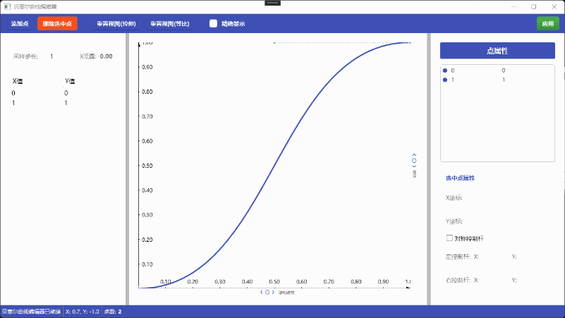

# BezierEditor - 贝塞尔曲线编辑器


一个功能强大的WPF贝塞尔曲线编辑器，提供直观的可视化编辑界面，支持创建、编辑和操作贝塞尔曲线。适用于动画曲线编辑、数学可视化、UI设计等多种场景。



## ✨ 功能特性

### 🎨 可视化编辑
- **直观的图形界面**：现代化的Material Design风格UI
- **实时预览**：编辑时实时更新曲线形状
- **精确/近似模式**：支持精确采样和贝塞尔分段两种显示模式
- **坐标轴和网格**：智能网格系统，自动调整刻度密度

### 🖱️ 交互操作
- **拖拽编辑**：直接拖拽控制点调整位置
- **控制柄调整**：拖拽控制柄调整曲线曲率
- **对称模式**：支持对称控制柄，保持曲线平滑
- **右键添加**：在画布任意位置右键添加新控制点
- **键盘支持**：Delete键删除选中点

### 📊 数据管理
- **采样数据表**：实时显示曲线上的采样点数据
- **属性面板**：详细显示和编辑选中点的所有属性
- **点列表**：所有控制点的可视化列表，支持选择
- **自动排序**：控制点按X坐标自动排序

### 🔧 视图控制
- **缩放功能**：支持水平和垂直独立缩放
- **平移视图**：拖拽画布空白区域平移视图
- **视图重置**：提供拉伸和等比两种重置模式
- **自适应网格**：根据缩放级别自动调整网格密度

## 🚀 快速开始

### 环境要求
- .NET 8.0 或更高版本
- Windows 7 或更高版本
- Visual Studio 2022 或更高版本（用于开发）

### 运行项目
1. 克隆或下载项目到本地
2. 使用Visual Studio打开 `BezierEditor.sln`
3. 编译并运行项目

### 基本使用
1. **添加点**：点击工具栏"添加点"按钮或在画布右键
2. **移动点**：直接拖拽控制点
3. **调整曲率**：拖拽控制点两侧的控制柄
4. **删除点**：选中点后点击"删除选中点"或按Delete键
5. **应用曲线**：编辑完成后点击"应用"按钮

## 📖 API 使用

### 关键函数：BezierEditor.Show

```csharp
// 显示贝塞尔曲线编辑器窗口
BezierEditor.Show(BezierCurve? bezierCurve, Action<BezierCurve> callback);
```

#### 参数说明
- `bezierCurve` (可选)：要编辑的现有贝塞尔曲线对象。如果为 `null`，编辑器将创建新的默认曲线。
- `callback`：回调函数，当用户点击"应用"按钮时调用，接收编辑后的贝塞尔曲线对象。

#### 使用示例

```csharp
// 示例1：创建新曲线并编辑
BezierEditor.Show(null, (editedCurve) => 
{
    // 处理编辑后的曲线
    Console.WriteLine($"曲线包含 {editedCurve.Points.Count} 个控制点");
    
    // 获取曲线上特定X坐标的Y值
    double yValue = editedCurve.GetValue<double>(0.5);
    Console.WriteLine($"在 x=0.5 处，y={yValue}");
});

// 示例2：编辑现有曲线
BezierCurve existingCurve = new BezierCurve();
// ... 初始化曲线 ...

BezierEditor.Show(existingCurve, (editedCurve) => 
{
    // 使用编辑后的曲线
    SaveCurveToFile(editedCurve);
});
```

#### 返回值处理
回调函数接收的 `BezierCurve` 对象包含：
- `Points`：控制点集合，按X坐标排序
- `GetValue<T>(double x)`：获取曲线上任意X坐标对应的Y值
- 完整的贝塞尔曲线计算功能

## 🏗️ 项目结构

### 核心类说明

#### [BezierEditor.xaml.cs](file://D:/Projects/BezierEditor/Source/BezierEditor.xaml.cs)
主窗口类，包含完整的用户界面和交互逻辑。
- 管理编辑器状态和工具模式
- 处理鼠标事件和用户输入
- 协调各个组件的工作

#### [BezierCurve](file://D:/Projects/BezierEditor/Source/Bezier.cs#BezierCurve) / [BezierCurveView](file://D:/Projects/BezierEditor/Source/BezierView.cs#BezierCurveView)
贝塞尔曲线数据模型和可视化视图。
- `BezierCurve`：纯数据模型，包含控制点和计算逻辑
- `BezierCurveView`：可视化扩展，管理WPF可视化元素

#### [BezierPoint](file://D:/Projects/BezierEditor/Source/Bezier.cs#BezierPoint) / [BezierPointView](file://D:/Projects/BezierEditor/Source/BezierView.cs#BezierPointView)
控制点数据模型和可视化视图。
- `BezierPoint`：控制点数据（位置、控制柄）
- `BezierPointView`：可视化控制点，包含椭圆、线条等UI元素

#### [BezierUtils](file://D:/Projects/BezierEditor/Source/Bezier.cs#BezierUtils)
贝塞尔曲线计算工具类。
- `Bezier()`：计算贝塞尔曲线上的点
- `GetPascalTriangleRow()`：获取杨辉三角系数

#### [Transformer](file://D:/Projects/BezierEditor/Source/Transformer.cs#Transformer)
坐标变换器，处理屏幕坐标和世界坐标的转换。
- 支持平移和缩放变换
- 维护变换矩阵

#### [Singleton<T>](file://D:/Projects/BezierEditor/Source/Singleton.cs#Singleton)
泛型单例模式基类，确保 `BezierEditor` 窗口单例。

### 文件结构
```
BezierEditor/
├── Source/
│   ├── BezierEditor.xaml          # 主窗口XAML界面
│   ├── BezierEditor.xaml.cs       # 主窗口代码逻辑
│   ├── Bezier.cs                  # 贝塞尔曲线核心类
│   ├── BezierView.cs              # 贝塞尔曲线视图类
│   ├── Transformer.cs             # 坐标变换器
│   └── Singleton.cs               # 单例模式基类
├── App.xaml                       # 应用程序定义
├── README.md                      # 项目说明文档
├── demo.gif                       # 演示动画
├── BezierEditor.csproj           # 项目文件
├── BezierEditor.slnx             # 解决方案文件
└── LICENSE                        # MIT许可证
```

## 🎯 使用场景

### 动画曲线编辑
- 创建平滑的缓动函数
- 编辑关键帧动画的插值曲线
- 设计自定义的动画时序函数

### 数学可视化
- 演示贝塞尔曲线的数学原理
- 教学工具：展示控制点对曲线形状的影响
- 数学函数可视化

### UI/UX设计
- 设计自定义的过渡动画曲线
- 创建独特的界面交互效果
- 原型设计工具

### 游戏开发
- 编辑角色移动路径
- 创建平滑的相机运动轨迹
- 设计特效动画曲线

## 🔧 高级功能

### 精确采样模式
启用"精确显示"复选框后，编辑器将使用100个采样点精确计算曲线，而不是使用贝塞尔分段近似。这在需要高精度时非常有用，但会消耗更多性能。

### 对称控制柄
启用"对称控制杆"后，调整一个控制柄会自动对称调整另一个控制柄，保持曲线在该点的平滑性。

### 智能网格系统
网格间距会根据视图缩放级别自动调整，确保在任何缩放级别下都有合适的网格密度。

### 数据导出
通过采样数据表格，可以获取曲线上任意间隔的采样点数据，便于导出到其他应用程序。

## 📝 开发说明

### 代码规范
项目遵循严格的代码规范：
- 类名：大驼峰命名法
- 接口：以'I'开头的大驼峰
- 函数名：大驼峰（C#）
- 变量名：小驼峰，私有变量加'_'后缀
- 枚举：以'E'开头的大驼峰，枚举项全大写
- 每行字符数 < 120
- 每个函数行数 < 50

### 扩展开发
要扩展编辑器功能，可以：
1. 继承 `BezierCurve` 或 `BezierPoint` 添加新功能
2. 修改 `BezierEditor.xaml` 添加新的UI控件
3. 扩展 `Transformer` 类支持新的坐标变换
4. 添加新的曲线类型支持

## 📄 许可证

本项目基于 MIT 许可证开源 - 查看 [LICENSE](LICENSE) 文件了解详情。

## 🙏 致谢

感谢所有为这个项目做出贡献的开发者。

**主要贡献者**：
- [ChenYiZh](https://github.com/ChenYiZh) - 项目创建者和主要开发者

---

**提示**：查看上方的demo.gif动画，了解编辑器的实际使用效果。动画展示了从添加控制点、调整曲线到应用曲线的完整工作流程。